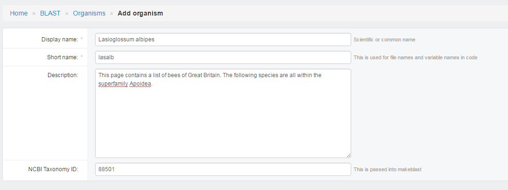

User Guide
==========

BLAST, HMMER, and Clustal are main functionality of genomics-workspace. Each one of this, we implemented it as a single `app
<https://docs.djangoproject.com/en/1.8/ref/applications/#s-projects-and-applications>`_ under Django.

In this section, we will go through details about how to configure each one of them.

In short, you need to configure database for BLAST and HMMER, but you don't need to configure anything for Clustal.

.. note:: The page is for user that wants to set up genomics-workspace by creating new admin user and confuguring in admin page. **If you want to know how to use services provided by genomics-workspace, see these tutorials:**

   * BLAST: https://i5k.nal.usda.gov/content/blast-tutorial
   * HMMER: https://i5k.nal.usda.gov/webapp/hmmer/manual/
   * CLUSTAL: https://i5k.nal.usda.gov/webapp/clustal/manual/

To get started, you need to setup an admin account::

   python manage.py createsuperuser

Follow the instruction shown on your terminal, then browse and login to the admin of genomics-workspace. Usually, the admin page should be at ``http://127.0.0.1:8000/admin/``.

BLAST Database Configuration
----------------------------

There are five steps to create a BLAST database.

* Add Organism (click the **Organism** icon at sidebar and click **Add organism**):

  * Display name should be scientific name.
  * Short name are used by system as a abbreviation.
  * Descriptions and NCBI taxa ID are automatically filled.

* Add Sequence types:

  * Used to classify BLAST DBs in distinct catagories.
  * Provide two kinds of molecule type for choosing, Nucleotide/Peptide.

* Add Sequence
* Add BLAST DB

  * Choose ``Organsim``
  * Choose ``Type`` (Sequence type)
  * Type location of fasta file in ``FASTA file path`` (It should be in ``<git-home>/media/blast/db/``)
  * Type ``Title`` name. (showed in HMMER page)
  * Type ``Descriptions``.
  * Check ``is shown``, if not check, this database would show in HMMER page.
  * Save

.. image:: img/add_blastdb.png

* Browse to ``http://127.0.0.1:8000/blast/``, you should able to see the page with dataset shown there.

HMMER Database Configuration
----------------------------
Like BLAST, HMMER databases must be configured then they could be searched.

Go django admin page and click Hmmer on left-menubar. You need to create HMMER db instance (Hmmer dbs) for each fasta file.

* Choose ``Organsim``
* Type location of peptide fasta file in ``FASTA file path``
* Type ``Title`` name. (showed in HMMER page)
* Type ``Descriptions``.
* Check ``is shown``, if not check, this database would show in HMMER page.
* Save

.. image:: img/hmmer_add.png
